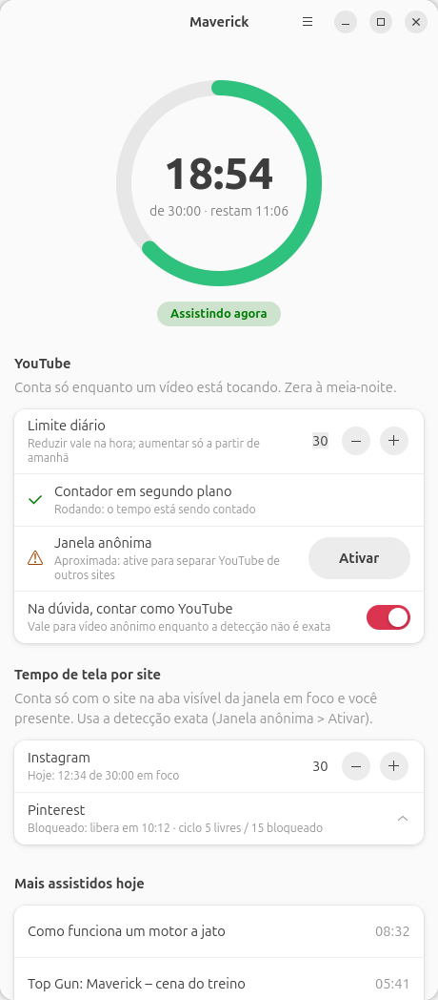

# Maverick

Maverick is a Linux desktop app with three jobs:

1. **YouTube daily limit.** Counts only the seconds during which a YouTube video is actually playing, as reported by the browser over MPRIS (D-Bus). A paused video or an idle tab costs nothing. At the limit (30 min by default) it pauses the player and shows "Tempo esgotado, volte amanhã" on every play attempt. Resets at local midnight. Raising the limit only takes effect the next day; lowering it takes effect immediately.
2. **Focused screen time per site.** Counts the seconds a site is the visible tab of the focused browser window while the user is present. Ships with Instagram at 30 min per day and Pinterest on a cycle of 5 min allowed, 15 min blocked. A blocked site in focus is covered by a full-screen notice.
3. **Browser-game site blocking.** Blocks a list of game sites system-wide through `/etc/hosts` plus Firefox and Chrome enterprise policies. Ships with the 10 largest browser-game portals in Brazil and worldwide.

| | |
|---|---|
| Version | 0.5.0 |
| Language | Python 3.10+, no pip dependencies |
| UI | GTK 4 + libadwaita (window), GTK 3 (on-screen counter) |
| Tested on | Ubuntu 26.04, GNOME 50 (Wayland), Firefox 156 (snap) |
| Package | `.deb`, architecture `all` |
| App ID | `io.github.luiz_nast.Maverick` |
| License | MIT |
| Repository | https://github.com/luiz-nast/maverick |
| Former name | `yt-limit` (old GitHub URL redirects) |



## Components

| Component | Command / file | Runs as | Purpose |
|---|---|---|---|
| Daemon | `maverick daemon`, systemd user unit `maverick.service` | user | Every second: YouTube time from MPRIS, focused site time from accessibility, pauses and covers at the limits, drives the counter. Checks the site block every 60 s |
| Window | `maverick` (menu entry "Maverick") | user | Today's usage ring, YouTube limit, private-window detection status with an Enable button, per-site screen time rules and live status, most watched videos, blocked-site list with Apply button |
| Counter | part of the daemon | user | Always-on-top pill at the top-right: `▶ MM:SS / MM:SS` while a YouTube video plays, `Instagram MM:SS / MM:SS` while a ruled site is focused |
| Cover | part of the daemon | user | Full work-area notice shown while a blocked site is the focused tab; hides as soon as another tab or app is focused |
| Block helper | `/usr/lib/maverick/maverick-blockctl` | root via `pkexec` | Writes `/etc/hosts` and browser policies. Validates every domain |

The window and the daemon share two JSON files. The window writes the config; the daemon reloads it on change, so a new limit applies immediately.

## YouTube counting

| Situation | Counted | Counter on screen |
|---|---|---|
| YouTube tab open, video paused | no | hidden |
| Video playing, tab visible or in background | yes, 1 s per second | `▶ MM:SS / MM:SS`, green |
| Video stops | no | stays 2 s, then hides |
| 5 min or less left | yes | yellow |
| Limit reached, play pressed | no; player paused within 1 s | `⛔ Tempo esgotado, volte amanhã` for 2 s |
| Other site playing media (Pinterest, Spotify Web) in a normal window | no | hidden |
| YouTube in a private window | yes, see detection layers | as above |
| Two YouTube tabs in the same Firefox process | counted once | as above |
| Reboot, logout, service restart | state persists; only a date change resets it | — |

Notifications: one at `warn_minutes_left`, one when the limit is reached.

### Limit changes

Today's limit can only go down. This removes the option of extending the current day once the time runs out.

| Action | Today | From tomorrow |
|---|---|---|
| Raise 30 → 45 | stays 30 | 45 |
| Lower 30 → 20 | 20 immediately | 20 |
| Lower 30 → 20, then raise to 30 the same day | stays 20 | 30 |
| Raise 30 → 90, then lower to 25 the same day | 25 immediately | 25 |

Implementation: `limit_minutes` holds the target limit; `today_cap` holds `{day, minutes}`, the ceiling for that date. Today's limit is `min(limit_minutes, today_cap.minutes)` when `today_cap.day` is today, otherwise `limit_minutes`. Every change sets `today_cap.minutes` to `min(current, new)`. The window waits 1.5 s after the last click before saving, so stepping through lower values on the way does not lower today's limit.

### Detection layers

Every second the daemon lists `org.mpris.MediaPlayer2.*` on the session bus and reads `PlaybackStatus` and `Metadata`. A playing player counts as YouTube if the first applicable layer says so:

1. **MPRIS metadata.** `xesam:url` (Firefox) or `mpris:artUrl` (Chrome) matches `youtube.com`, `youtu.be`, `youtube-nocookie.com`, `ytimg.com` or `googlevideo.com`. Exact.
2. **Accessibility tree (AT-SPI).** Used only for a browser player with no URL and no art URL, which is how Firefox and Chrome report media in private windows (Firefox sets the title to "O Firefox está reproduzindo mídia"). For each browser window on the accessibility bus the daemon reads:
   - the window title, which holds the selected tab's title and, for private windows, the suffix `— navegação privativa` (pt-BR) or `Private Browsing` (en);
   - the tab list: each tab's title, whether it is selected, and its sound button (`Silenciar aba`/`Mute tab` while playing, `Reproduzir som na aba`/`Play tab` when autoplay is blocked).

   Only private windows are considered (all windows if none is recognized as private). In each one, if the tab list agrees with the window title and some tab is playing sound, that tab decides; otherwise the selected tab from the window title decides. The media counts as YouTube when the deciding title ends with `- YouTube` or `- YouTube Music`. Requires the browser on the accessibility bus: on GNOME, `toolkit-accessibility` must be on before the browser starts (button **Ativar** in the window, or `gsettings set org.gnome.desktop.interface toolkit-accessibility true`), then restart the browser. Cached 3 s.
3. **Fallback.** If no browser is on the accessibility bus, private-window media counts as YouTube when `count_private_media` is `true` (default; switch "Na dúvida, contar como YouTube" in the window). Any media played in a private window is then counted and, after the limit, paused.

`maverick check` prints which layer applies right now.

## Focused screen time per site

### Rules

| Site | Mode | Default | Meaning |
|---|---|---|---|
| Instagram (`instagram.com`) | `daily` | 30 min | 30 min of focused time per day. Same limit rule as YouTube: lowering applies now, raising from tomorrow |
| Pinterest (`pinterest.com`) | `cycle` | 5 / 15 | 5 min of focused time allowed, then 15 min blocked by the clock, then a new 5 min round. Changing either value applies from the next round |

Subdomains match (`br.pinterest.com`, `www.instagram.com`). Rules are edited in the window group "Tempo de tela por site".

### What counts as focused

A second counts for a site when all hold:

1. A browser window is the active (focused) window, read from the AT-SPI `ACTIVE` state of its frame.
2. The visible tab of that window (document with state `SHOWING`) has a URL on the site, read from the AT-SPI Document attribute `DocURL`.
3. The user is present: keyboard or mouse input in the last 90 s (GNOME `org.gnome.Mutter.IdleMonitor`), or media from that site is playing.

A tab open in the background, a browser window behind another app, or an unattended screen does not count. Requires the browser on the accessibility bus (see detection layer 2).

### At the limit

- A notification fires once when the site becomes blocked.
- While the blocked site is the focused tab, a full-screen notice covers the work area with the reason and the time left. It takes no keyboard focus, so Ctrl+Tab or Ctrl+W still work; switching away hides it within a second.
- Media from that site (or hidden private-window media) is paused.

## Site blocking

### Default list

| Site | Domains |
|---|---|
| Click Jogos | `clickjogos.com.br` |
| Friv | `friv.com` |
| Poki | `poki.com`, `poki.com.br` |
| CrazyGames | `crazygames.com`, `crazygames.com.br` |
| Jogos 360 | `jogos360.com.br` |
| 1001 Jogos | `1001jogos.com.br` |
| Y8 | `y8.com` |
| Miniclip | `miniclip.com` |
| Coolmath Games | `coolmathgames.com` |
| Kizi | `kizi.com` |

The list lives in `blocked_sites` in the config and can be edited in the window or with `maverick block add|remove`. Input is normalized: `https://www.Poki.com/jogo` becomes `poki.com`.

### Mechanism

| Layer | File | What is written | Covers | Takes effect |
|---|---|---|---|---|
| hosts | `/etc/hosts` | Managed block between `# >>> maverick` and `# <<< maverick <<<`; each domain plus `www.` and `m.` mapped to `0.0.0.0` and `::` | Every browser and program using the system resolver. Firefox honors it even with DNS over HTTPS (`network.trr.exclude-etc-hosts` defaults to true) | New connections after the DNS cache expires (resolved cache is flushed on apply; Firefox caches up to 60 s) |
| Firefox | `/etc/firefox/policies/policies.json` | `WebsiteFilter.Block` entries `*://*.<domain>/*`, merged with any existing policies | All subdomains, Firefox block page | After Firefox restarts. The Firefox snap reads `/etc/firefox` through its `etc-firefox` plug |
| Chrome / Chromium | `/etc/opt/chrome/policies/managed/maverick.json`, `/etc/chromium/policies/managed/maverick.json` | `{"URLBlocklist": [domains]}` | All subdomains | After browser restart |

### Lifecycle

- Package install: applies the current list from `/etc/hosts`, or the default list on a fresh system.
- Package upgrade: re-applies the current list.
- `apt remove maverick`: removes all three layers.
- Changes: window button **Aplicar** or `maverick block apply`. Both call `pkexec maverick-blockctl apply <domains>`; polkit action `io.github.luiz_nast.Maverick.block`, `auth_admin_keep`.
- Removing a site in the window asks for confirmation.
- The daemon checks `/etc/hosts` every 60 s and sends a critical notification once if a listed domain is missing.

### Limits of blocking

- A tab already open on a blocked site keeps working until it reloads.
- Mirror and clone domains (e.g. `friv5online.com`) are not covered unless added.
- Anyone with sudo can undo it. The goal is friction, not lockdown.

## Install

From the release:

```bash
wget https://github.com/luiz-nast/maverick/releases/download/v0.5.0/maverick_0.5.0_all.deb
sudo apt install ./maverick_0.5.0_all.deb
systemctl --user daemon-reload
systemctl --user enable --now maverick.service
```

From source (builds the `.deb`, installs it, restarts the daemon; also the update path):

```bash
git clone https://github.com/luiz-nast/maverick.git ~/maverick
~/maverick/packaging/install-system.sh
```

Installed paths:

| Path | Content |
|---|---|
| `/usr/bin/maverick` | launcher |
| `/usr/lib/maverick/maverick/` | Python package |
| `/usr/lib/maverick/maverick-blockctl` | root helper |
| `/usr/lib/systemd/user/maverick.service` | daemon unit, enabled globally on install |
| `/usr/share/applications/io.github.luiz_nast.Maverick.desktop` | menu entry |
| `/usr/share/icons/hicolor/scalable/apps/io.github.luiz_nast.Maverick.svg` | icon |
| `/usr/share/polkit-1/actions/io.github.luiz_nast.Maverick.policy` | polkit action |

Dependencies: `python3`, `python3-gi`, `gir1.2-gtk-3.0`, `gir1.2-gtk-4.0`, `gir1.2-adw-1 (>= 1.5)`, `libnotify-bin`, `pkexec`.

Uninstall: `sudo apt remove maverick`.

Do not start the daemon from an AppArmor-confined process (for example from inside a snap): the Firefox snap answers its D-Bus calls with `Access denied`. The systemd user service and a normal terminal are unconfined.

## CLI

```
maverick                     open the window
maverick daemon [--debug] [--no-overlay]
                             run the counter in the foreground (the service runs this)
maverick status              YouTube today, top 10 videos, each site's status
maverick check               MPRIS players, accessibility windows and tabs, focused tab URL, block status
maverick limit N             set the daily limit; lowering applies now, raising from tomorrow
maverick reset               zero today's counter
maverick block list          blocked sites and whether each is applied
maverick block add D...      add domains to the list
maverick block remove D...   remove domains from the list
maverick block apply         apply the list to the system (admin password)
maverick --version
```

Service:

```bash
systemctl --user status maverick
journalctl --user -u maverick -f
```

## Configuration

`~/.config/maverick/config.json`. Missing keys use defaults. Reloaded by the daemon on change. Editing the file by hand bypasses the limit rule.

```json
{
  "limit_minutes": 30,
  "today_cap": { "day": "2026-10-05", "minutes": 30 },
  "hide_after_seconds": 2,
  "warn_minutes_left": 5,
  "count_private_media": true,
  "blocked_sites": ["clickjogos.com.br", "friv.com", "poki.com", "..."],
  "sites": {
    "instagram.com": { "name": "Instagram", "mode": "daily", "minutes": 30, "today_cap": null },
    "pinterest.com": { "name": "Pinterest", "mode": "cycle", "allow_minutes": 5, "block_minutes": 15 }
  }
}
```

| Key | Type | Default | Meaning |
|---|---|---|---|
| `limit_minutes` | int | 30 | Daily YouTube limit from tomorrow on (and today when there is no cap for today) |
| `today_cap` | object or null | null | `{day, minutes}`: ceiling for that date, written on every limit change |
| `hide_after_seconds` | int | 2 | Counter stays visible this long after playback stops; also the duration of the "time's up" notice |
| `warn_minutes_left` | int | 5 | Remaining minutes for the warning notification and yellow counter |
| `count_private_media` | bool | true | Count hidden-metadata browser media as YouTube when no browser is on the accessibility bus. Also a switch in the window |
| `blocked_sites` | list of domains | the 12 default domains | Sites to block; applied to the system only via Apply / `maverick block apply` |
| `sites` | object | Instagram daily 30, Pinterest cycle 5/15 | Focused screen time rules by domain. `daily`: `minutes`, `today_cap`. `cycle`: `allow_minutes`, `block_minutes` |

State: `~/.local/share/maverick/state.json`, written on every counted second and on SIGTERM/SIGINT/SIGHUP.

```json
{ "day": "2026-10-08", "seconds": 1134, "per_video": { "<xesam:title>": 512 },
  "sites": { "instagram.com": { "seconds": 754 },
             "pinterest.com": { "seconds": 300, "round_used": 300, "round_allow": 300, "blocked_until": 1791449000.0 } } }
```

A `day` different from today's local date resets `seconds`, `per_video` and each site's `seconds`; the Pinterest cycle (`round_*`, `blocked_until`, a Unix time) follows the clock across midnight. `maverick reset` clears everything for today, the cycle included. The daemon reloads the file when another process changes it (for example `maverick reset`), so external edits are not overwritten by the next counted second.

## Repository layout

```
maverick/__main__.py    CLI and subcommands
maverick/app.py         daemon loop: YouTube and focused-site counting, pause, cover, overlay, block watch
maverick/sites.py       focused screen time rules: daily and cycle, URL matching, status texts
maverick/dbus.py        shared synchronous D-Bus helpers (Gio)
maverick/mpris.py       MPRIS players over D-Bus, Pause()
maverick/a11y.py        AT-SPI: window titles, tabs, tab sound state, focused window's visible URL
maverick/overlay.py     GTK 3 always-on-top counter pill and blocking cover (forces GDK_BACKEND=x11)
maverick/gui.py         GTK 4 + libadwaita window
maverick/blocking.py    default site list, domain validation, hosts/policy rendering, status
maverick/blockctl.py    root helper: writes /etc/hosts and browser policies atomically
maverick/store.py       config and state JSON, limit rule, shared usage status
data/                   icon, .desktop, polkit policy, systemd unit, helper launcher
packaging/build-deb.sh  builds dist/maverick_<version>_all.deb
packaging/install-system.sh
tests/                  unittest suite
```

## Development

```bash
python3 -m maverick                         # window from source
python3 -m maverick daemon --debug          # daemon from source
python3 -m unittest discover -s tests -t .  # tests
packaging/build-deb.sh                      # build the package
```

## Counter window details

- GTK 3, undecorated, type hint DOCK, keep-above, sticky, no focus, not in the taskbar.
- GNOME on Wayland ignores keep-above for native Wayland windows, so the counter runs through XWayland (`GDK_BACKEND=x11`), where Mutter honors `_NET_WM_STATE_ABOVE`.
- Placed at the top-right of the primary monitor's work area, below the top bar.
- Fullscreen video covers it; counting and pausing continue.

## Known limitations

- Chrome does not publish the page URL over MPRIS; detection relies on the `i.ytimg.com` thumbnail. Shorts without artwork may fall to layer 2 or 3.
- YouTube Music and YouTube ads are counted.
- Layer 2 is tested against Firefox 156 (snap). Firefox can leave the tab list in the accessibility tree stale for a window that is not in the foreground; the window title stays current, so detection then relies on the selected tab only. A YouTube video playing in a non-selected tab of such a window is not detected.
- With accessibility on, GTK apps and Firefox maintain accessibility trees, which costs some CPU and memory. Maverick's own window and counter are on that bus too; the scan skips its own process to avoid blocking on itself.
- A browser with MPRIS disabled (Firefox `media.hardwaremediakeys.enabled = false`) is invisible to the daemon.
- Focused-site time depends on the browser reporting the `ACTIVE` state of its window over AT-SPI. Electron apps (for example Claude Desktop) do not report it; Firefox is expected to. If a site never counts, `maverick check` shows whether a focused tab is seen.
- The cover sits over the work area but the browser keeps keyboard focus: keyboard scrolling still moves the hidden page.

## Troubleshooting

| Symptom | Check |
|---|---|
| Counter never appears | `maverick check` lists a `Playing` YouTube player? If not, the browser is not exposing MPRIS. |
| Private window not counted | `maverick check` shows `privado/sem metadados`? Then layer 3 applies unless `count_private_media` is false. |
| Other media paused or counted in a private window | Layer 3 fallback. Click **Ativar** on "Janela anônima" in the window and restart Firefox, or turn off "Na dúvida, contar como YouTube". |
| Blocked site still opens | Tab opened before the block: reload. Firefox block page: restart Firefox. `maverick block list` shows `✗`: click Apply. |
| "Bloqueio no sistema indisponível" | Running from source without the package. Install the `.deb`. |
| Raised the limit, today's did not change | By design: raises apply from tomorrow. `maverick status` shows both values. |
| Instagram or Pinterest never counts | While the site is focused, `maverick check` must show "Aba visível da janela em foco" with its URL. If it reports no focused window, the browser is not reporting focus. |
| `Access denied` in logs | Daemon started from a confined process. Use the systemd service. |
