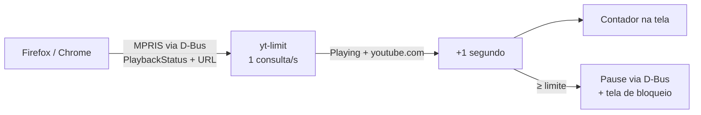

<div align="center">

# ⏱️ yt-limit

**Limite diário de YouTube para Linux, como aplicativo de sistema.**<br>
Conta só o tempo em que um vídeo está *de fato tocando*. Aba aberta não gasta nada.

[](https://www.python.org/)
[](#requisitos)
[](#requisitos)
[](LICENSE)

```
                                             ┌────────────────────┐
                                             │ ▶ 12:34 / 30:00    │   ← canto superior direito
                                             └────────────────────┘
```

</div>

---

## 💡 Por quê

Extensões de navegador contam o tempo com a aba aberta. Resultado: você deixa um vídeo
pausado em segundo plano, esquece, e seus preciosos 30 minutos evaporam sem você assistir
nada.

O `yt-limit` roda **fora do navegador** e pergunta ao próprio player se o vídeo está tocando.
Pausou, contagem para. Fechou a aba, contagem para. Está tocando, cada segundo conta.

## ✨ O que ele faz

| | |
|---|---|
| 🎯 **Conta só reprodução real** | Usa o estado `Playing`/`Paused` que o navegador publica via MPRIS |
| 👀 **Contador na tela** | Pílula sempre-no-topo que aparece só enquanto o vídeo toca: verde tocando, 🟡 nos últimos 5 min. Some 2 s depois de pausar |
| ⛔ **Bloqueio de verdade** | Ao bater o limite, pausa o vídeo via D-Bus. Deu play de novo? Pausa no segundo seguinte e mostra *Tempo esgotado, volte amanhã* |
| 🔔 **Avisos** | Notificação quando faltam 5 min e quando o limite estoura |
| 🌙 **Zera à meia-noite** | Cada dia começa do zero |
| 📊 **Relatório por vídeo** | `yt-limit --status` mostra onde o tempo foi |
| 🚀 **Sobe com a sessão** | Instala como serviço systemd de usuário |

## 🔍 Como funciona



Firefox e Chrome/Chromium expõem a mídia de cada página como um player
[MPRIS](https://specifications.freedesktop.org/mpris-spec/latest/) no D-Bus da sessão.
O `yt-limit` lê isso uma vez por segundo e só soma tempo quando **as duas** condições valem:

1. `PlaybackStatus == Playing`
2. a URL da página (Firefox) ou a capa do vídeo (Chrome) é do YouTube

Nada de injetar script em página, nada de extensão, nada de olhar título de janela.

## 📦 Requisitos

- Linux com D-Bus de sessão. Testado no **Ubuntu 26.04 + GNOME Wayland**; deve funcionar em KDE e outros.
- Python 3.10+ com PyGObject e GTK 3:

  ```bash
  sudo apt install python3-gi gir1.2-gtk-3.0
  ```

- Firefox ou Chrome/Chromium. No Firefox o MPRIS já vem ligado por padrão.

> **Zero dependências pip.** O app usa só a biblioteca padrão e os bindings GTK do sistema,
> por isso roda direto no `python3` do sistema, sem venv.

## 🚀 Instalação

```bash
git clone https://github.com/luiz-nast/yt-limit.git ~/yt-limit
cd ~/yt-limit
./install.sh
```

O instalador:

- copia o pacote para `~/.local/lib/yt-limit`
- cria o comando `~/.local/bin/yt-limit`
- registra e inicia o serviço `yt-limit.service` do systemd de usuário

Pronto. O contador aparece no canto da tela e o serviço sobe sozinho a cada login.

```bash
systemctl --user status yt-limit      # está rodando?
journalctl --user -u yt-limit -f      # logs ao vivo
./uninstall.sh                        # remove tudo (config e estado ficam)
```

## 🎮 Uso

```bash
yt-limit --status        # tempo de hoje + top 10 vídeos
yt-limit --limit 45      # muda o limite diário (minutos)
yt-limit --reset         # zera o contador de hoje
yt-limit --debug         # roda em primeiro plano logando cada player detectado
yt-limit --no-overlay    # só conta e pausa, sem janelas
```

Depois de mudar o limite, reinicie o serviço:

```bash
systemctl --user restart yt-limit
```

### Estados do contador

A pílula só aparece enquanto um vídeo do YouTube está tocando e some 2 segundos
depois que ele para. Fora isso, a tela fica limpa.

| Ícone | Cor | Significado |
|:---:|:---:|---|
| `▶` | verde | Tocando, contando |
| `▶` | amarelo | Tocando, faltam 5 min ou menos |
| `⛔` | vermelho | *Tempo esgotado, volte amanhã*: aparece 2 s a cada tentativa de play |

## ⚙️ Configuração

Arquivo: `~/.config/yt-limit/config.json`

```json
{
  "limit_minutes": 30,
  "hide_after_seconds": 2,
  "warn_minutes_left": 5
}
```

| Chave | Padrão | Descrição |
|---|:---:|---|
| `limit_minutes` | `30` | Limite diário em minutos |
| `hide_after_seconds` | `2` | Segundos que a pílula continua na tela depois que o vídeo para |
| `warn_minutes_left` | `5` | Minutos restantes para a notificação de aviso |

Estado do dia (contagem e tempo por vídeo): `~/.local/share/yt-limit/state.json`

## 🗂️ Estrutura

```
yt_limit/
├── __main__.py   CLI (--status, --limit, --reset, ...)
├── app.py        loop de 1 s: consulta, soma, avisa, bloqueia
├── mpris.py      leitura dos players via D-Bus e detecção de YouTube
├── overlay.py    pílula sempre-no-topo (GTK 3)
└── store.py      config e estado diário em JSON
install.sh        serviço systemd de usuário
uninstall.sh
```

## ⚠️ Limitações conhecidas

- **Tela cheia** cobre o contador. A contagem e o bloqueio continuam; só a pílula fica escondida.
- **Chrome** não expõe a URL da página no MPRIS; a detecção usa a capa (`i.ytimg.com`).
  Vídeos normais funcionam; Shorts sem capa podem escapar.
- **YouTube Music** também conta, pois usa o mesmo domínio de capas.
- **GNOME Wayland** não permite "sempre no topo" para janelas nativas; o app força
  `GDK_BACKEND=x11` (XWayland), que o Mutter respeita.
- Se o daemon for iniciado por um processo confinado por AppArmor (dentro de outro snap,
  por exemplo), o Firefox snap responde *Access denied*. Rode pelo terminal ou pelo serviço
  systemd, que é o caminho normal.

## 📄 Licença

[MIT](LICENSE)
